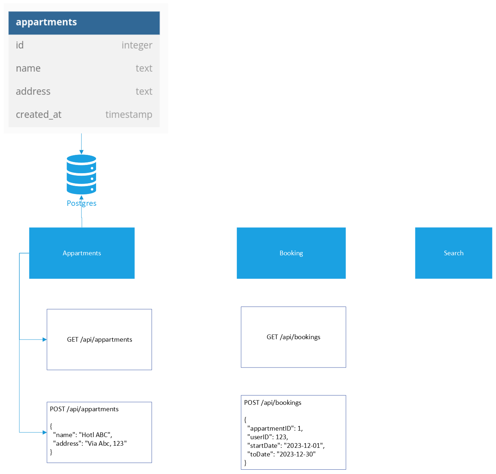

# microservice-project

## Overview

## TODOs

- [X] Implement HTTP endpoints in apartment service that just accept requests as per sample file
- [X] Implement HTTP endpoints in booking service
- [X] we can try to check if an apartment exist before allowing a booking (direct communication with the other service)
- [X] Connect apartment service to a database
- [x] Apartments - Bookings Message queue
  - [x] Apartment post event (apartment added and deleted) to queue
  - [x] Booking register for apartment events
  - [X] When a new apartment is created, apartment service sends a rabbit mq message, booking service listen and create the apartment in it's own DB too

- [X] Booking post event to another queue (booking added, changed and cancelled)
- [X] Booking to post events into exchange

- [X] Search service -> javascript
  - [X] needs to have a DB with apartments
  - [X] needs to have a DB with bookings
  - [X] needs to know which apartment exists and are available
  - [X] should be able to search apartments using "from" date and "to" date
  - [X] register for booking events
  - [X] register for apartment events
  - [X] Direct call from Search service to Apartment service, if apartments table is empty
  - [X] Direct call from Search service to Booking service, if bookings table is empty
  
- [X] Dockerize applications
  - [X] Apartments
  - [X] Bookings
  - [X] Search
  - [X] Gateway
  - [X] Configuration for yaml file for Gateway
- [ ] Implement event sourcing for Booking service
- [ ] Implement NoSQL DB for apartments DB
- [X] Docker multistage build
  - [X] Gateway
  - [X] Apartments
  - [X] Bookings
- [X] In apartment, when adding new apartment, can check if id is passed in correctly. If yes, use that. If not, generate new UUID
- [X] Ensure error messages are set as JSON

## Requirements

- Go: 1.21.4
- Docker
  
## Useful Resources

- [Diagram in Visio](https://scientificnet-my.sharepoint.com/:u:/r/personal/mponza_unibz_it/Documents/CPD%20-%20Microservices%20Project.vsdx?d=w6328c77940f14158bfbf177a6352d738&csf=1&web=1&e=2ctcRj)
